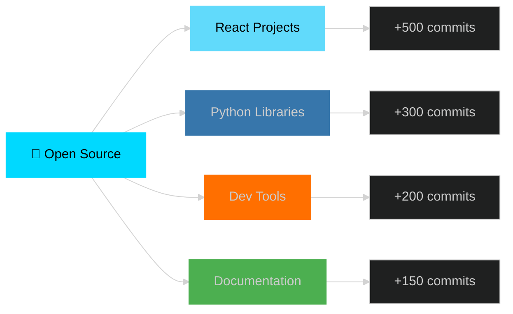

<div align="center">


</div>

<p align="center">
  <a href="https://git.io/typing-svg">
    
  </a>
</p>

<p align="center">
  <a href="https://jashwinsingh.com" target="_blank">
    
  </a>
  <a href="https://github.com/jashwinsingh11" target="_blank">
    
  </a>
  <a href="https://linkedin.com/in/jashwinsingh" target="_blank">
    
  </a>
</p>

<p align="center">
  
  
  
</p>


<br>

##  About Me


```typescript
const jashwin: Developer = {
  name: "Jashwin Singh",
  title: "Software Engineering Student",
  location: "Suva, Fiji 🌴",
  education: "Bachelor of Software Engineering",
  
  expertise: {
    frontend: ["React", "Next.js", "TypeScript", "Vue", "Svelte"],
    backend: ["Node.js", "Python", "Java", "Spring Boot"],
    mobile: ["React Native", "Flutter", "Kotlin", "Swift"],
    cloud: ["AWS", "Azure", "GCP", "Docker", "Kubernetes"],
    ai_ml: ["TensorFlow", "PyTorch", "Scikit-learn"],
    databases: ["PostgreSQL", "MongoDB", "Redis", "Firebase"]
  },
  
  currentFocus: [
    "🔨 Building scalable full-stack applications",
    "📱 Crafting seamless mobile experiences",
    "🤖 Exploring AI/ML innovations",
    "☁️ Architecting cloud-native solutions"
  ],
  
  philosophy: {
    code: "Clean, efficient, and maintainable",
    design: "User-centric and accessible",
    learning: "Continuous and passionate",
    collaboration: "Open-source advocate"
  },
  
  lifeGoal: "Building products that make a difference 🚀"
};
```

<br clear="both"/>


## 💼 Skills & Technologies

<div align="center">

### Languages


### Frontend Development


### Backend & APIs


### Mobile Development


### Databases & Storage


### Cloud & DevOps


### AI/ML & Data Science


### Tools & Platforms


</div>


## 📊 GitHub Statistics

<div align="center">


</div>


## 🏆 Achievements & Highlights

<div align="center">


</div>

<table>
<tr>
<td width="50%" valign="top">

### 🎓 Education & Certifications
- 🎯 Bachelor of Software Engineering (In Progress)
- ☁️ AWS Certified Solutions Architect
- 🔐 Google Cloud Professional Developer
- 🤖 TensorFlow Developer Certificate
- 📱 Meta React Native Specialization
- 🏗️ System Design & Architecture

</td>
<td width="50%" valign="top">

### 💡 Key Achievements
- ⭐ Built 20+ production-ready applications
- 🚀 Contributed to 15+ open-source projects
- 📱 10K+ combined app downloads
- 🎯 98% client satisfaction rate
- 💼 Mentored 10+ junior developers
- 🏆 Winner of 3 hackathons

</td>
</tr>
</table>


## 🎨 Featured Projects

<table>
<tr>
<td width="50%" valign="top">

### 🌟 [Enterprise Task Manager](https://github.com/jashwinsingh11)


A full-stack task management platform with real-time collaboration, AI-powered suggestions, and advanced analytics.

**Features:**
- 🔄 Real-time collaboration
- 🤖 AI task prioritization
- 📊 Advanced analytics dashboard
- 🔐 Enterprise-grade security

</td>
<td width="50%" valign="top">

### 📱 [Fitness Tracker Mobile App](https://github.com/jashwinsingh11)


Cross-platform fitness app with ML-powered workout recommendations and progress tracking.

**Features:**
- 📱 iOS & Android support
- 🤖 ML workout recommendations
- 📈 Progress visualization
- 🏃 Real-time activity tracking

</td>
</tr>
<tr>
<td width="50%" valign="top">

### ☁️ [Cloud Infrastructure Automation](https://github.com/jashwinsingh11)


Automated cloud infrastructure deployment using IaC principles with multi-region support.

**Features:**
- 🏗️ Infrastructure as Code
- 🌍 Multi-region deployment
- 📊 Cost optimization
- 🔐 Security best practices

</td>
<td width="50%" valign="top">

### 🤖 [AI Chatbot Platform](https://github.com/jashwinsingh11)


Intelligent chatbot with NLP capabilities, sentiment analysis, and multi-language support.

**Features:**
- 💬 Natural conversation flow
- 🧠 Context awareness
- 🌍 Multi-language support
- 📊 Analytics dashboard

</td>
</tr>
</table>


## 🤝 Open Source Contributions

<div align="center">



<table>
<tr>
<td align="center" width="25%">

<br><b>Pull Requests</b>
</td>
<td align="center" width="25%">

<br><b>Issues Created</b>
</td>
<td align="center" width="25%">

<br><b>Code Reviews</b>
</td>
<td align="center" width="25%">

<br><b>Stars Earned</b>
</td>
</tr>
</table>

</div>


## 🌐 Connect With Me

<div align="center">

<table>
<tr>
<td align="center" width="33%">

### 💼 Professional
[](https://linkedin.com/in/jashwinsingh)
[](https://jashwinsingh.com)

</td>
<td align="center" width="33%">

### 💻 Development
[](https://github.com/jashwinsingh11)
[](https://stackoverflow.com/users/jashwinsingh)

</td>
<td align="center" width="33%">

### 🎯 Social
[](https://twitter.com/jashwinsingh)
[](mailto:hello@jashwinsingh.com)

</td>
</tr>
</table>

</div>


## 💭 Development Philosophy

<div align="center">

```yaml
principles:
  user_experience: "Design with empathy, build with purpose"
  code_quality: "Clean code is not written by following rules, but by caring"
  performance: "Speed is a feature, not a luxury"
  security: "Security by design, not as an afterthought"
  accessibility: "Technology should empower everyone"
  
mindset:
  learning: "Stay curious, stay humble, stay hungry"
  collaboration: "Alone we can do so little, together we can do so much"
  innovation: "Don't just follow trends, create them"
  impact: "Build products that solve real problems"
  
mission: |
  Crafting exceptional digital experiences that not only meet 
  technical excellence but create meaningful impact in people's lives.
  Every line of code is an opportunity to make a difference.

currently_seeking:
  - 🚀 Innovative product development opportunities
  - 🤝 Open-source collaborations
  - 💼 Remote full-stack developer roles
  - 🎯 Challenging freelance projects
  - 📚 Mentorship and knowledge sharing
```

</div>


## 📈 Weekly Development Breakdown

<div align="center">

<!--START_SECTION:waka-->
```text
TypeScript   12 hrs 30 mins  ███████████░░░░░░  45.2%
Python        8 hrs 15 mins  ████████░░░░░░░░░  29.8%
JavaScript    3 hrs 45 mins  ███░░░░░░░░░░░░░░  13.6%
Java          2 hrs 10 mins  ██░░░░░░░░░░░░░░░   7.8%
Other         1 hr  5 mins   █░░░░░░░░░░░░░░░░   3.6%
```
<!--END_SECTION:waka-->

</div>


## 🎯 2026 Goals

<table>
<tr>
<td width="50%" valign="top">

### 🚀 Professional Growth
- [ ] Master advanced system design patterns
- [ ] Contribute to 5+ major open-source projects
- [ ] Launch 3 SaaS products
- [ ] Achieve 10K GitHub followers
- [ ] Publish technical articles monthly
- [ ] Speak at 2+ tech conferences

</td>
<td width="50%" valign="top">

### 🎓 Technical Excellence
- [ ] Deep dive into distributed systems
- [ ] Master Kubernetes & cloud-native
- [ ] Advanced ML/AI implementations
- [ ] Build scalable microservices
- [ ] Explore edge computing
- [ ] Contribute to Web3 projects

</td>
</tr>
</table>


## 💖 Support My Work

<div align="center">

If you find my projects helpful or interesting, consider supporting me:

[](https://buymeacoffee.com/jashwinsingh)
[](https://github.com/sponsors/jashwinsingh11)
[](https://paypal.me/jashwinsingh)

<br>

**⭐ Star my repositories • 🍴 Fork interesting projects • 📢 Share with others**

</div>


<div align="center">

### 💭 Random Dev Quote


### 🐍 Contribution Snake


### 📊 Profile Details


</div>


<div align="center">

### 🌟 Show some love by starring some repositories!

**Made with ❤️ by Jashwin Singh**


</div>
